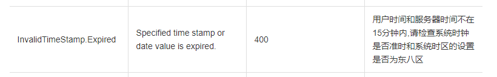

# 阿里云SDK请求InvalidTimeStamp.Expired

## 问题描述：

阿里短信发送报错 InvalidTimeStamp.Expired

获取OSS的sts凭证报错 InvalidTimeStamp.Expired


## 解决方案：

阿里官网解释


## 步骤：

查看linux服务器时间: date -R
结果: Wed, 02 Jan 2019 14:28:49 -0800
其中 -0800是西八区,需要改为东八区


解决方法：
在linux服务器执行: ntpdate ntp1.aliyun.com
意思就是同步阿里云服务器时间


```sh
# ntpdate 命令不支持的，自己安装
yum install ntpdate
ntpdate ntp1.aliyun.com
```

