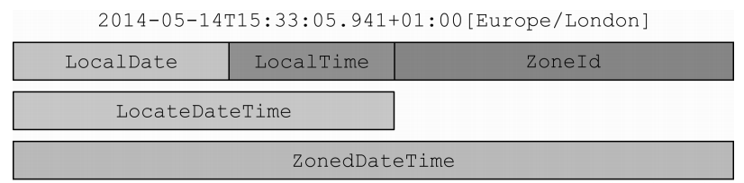

# LocalDate、LocalTime、LocalDateTime的常用API和计算

从Java 8开始，`java.time`包提供了新的日期和时间API，主要涉及的类型有：

- 本地日期和时间：`LocalDateTime`，`LocalDate`，`LocalTime`；
- 带时区的日期和时间：`ZonedDateTime`；
- 时刻：`Instant`；
- 时区：`ZoneId`，`ZoneOffset`；
- 时间间隔：`Duration`。

以及一套新的用于取代`SimpleDateFormat`的格式化类型`DateTimeFormatter`。

本文仅仅简述部分接口，详细还请了解[官方API文档](https://docs.oracle.com/javase/8/docs/api/)


## 一、概述

`LocalDateTime`表示日期和时间

`LocalDate`用来表示日期

`LocalTIme`表示时间，大概就是`LocalDateTime = LocalDate + LocalTime`

`ZonedDateTime`带时区的日期和时间

他们的关系：




### 常用解析

```java
LocalTime.of(int hour,int minute,int second)// 指定时、分、秒，参数不可缺省

LocalDate.of(int year,int mouth,int day)// 指定年、月、日，参数不可缺省，这里指定月份的话是从1开始，与Calendar不同，Calendar的月份是从0开始，这也就是LocalDate比Calendar处理时间要方便的多。

LocalDate.of(int year,MOUTH mouth,int day)// 指定年、月、日

LocalDateTime.of(nt year,int mouth,int day,int hour,int minute,int second,int nanoOfSecond)// 指定年、月、日、时、分、秒、纳秒，参数可缺省

LocalDateTime.of(nt year,MOUTH mouth,int day,int hour,int minute,int second,int nanoOfSecond)

LocalDateTime.of(LocalDate localDate,LocalTime localTime)// 指定localDate localTime组合成日期时间
```


这里我们使用常用构造打印一下：

```java

    public static void main(String args[] ){
        // 当前日期和时间
        LocalDateTime localDateTime = LocalDateTime.now();
        // 转换到当前日期
        LocalDate localDate = localDateTime.toLocalDate();
        // 转换到当前时间
        LocalTime localTime = localDateTime.toLocalTime();

        // LocalDate的部分构造
        LocalDate localDate1 = LocalDate.now();
        LocalDate localDate2 = LocalDate.of(2020, 02, 20);
        LocalDate localDate3 = LocalDate.parse("2020-02-20");
        LocalDate localDate4 = LocalDate.of(2020, Month.FEBRUARY, 20);

        // LocalDate的部分构造
        LocalTime localTime1 = LocalTime.now();
        LocalTime localTime2 = LocalTime.parse("07:30");
        LocalTime localTime3 = LocalTime.of(7, 30);
        LocalTime localTime4 = LocalTime.of(7, 29, 59, 999000123);

        // LocalDateTime的部分构造
        LocalDateTime localDateTime1 = LocalDateTime.of(localDate1, localTime1);
        LocalDateTime localDateTime2 = LocalDateTime.now();
        LocalDateTime localDateTime3 = LocalDateTime.now(ZoneId.of("America/Chicago"));
        LocalDateTime localDateTime4 = LocalDateTime.parse("2020-02-20T08:15:59");
        
        // 获取时区
        ZoneId romeZone = ZoneId.of("Europe/Rome");
        ZoneId defaultZone = TimeZone.getDefault().toZoneId();
        // 获取当前时刻
        Instant instant = Instant.now();
        // 获取日期和日期时间
        LocalDate localDate5 = LocalDate.of(2020, Month.OCTOBER, 31);
        LocalDateTime localDateTime5 = LocalDateTime.of(2020, Month.OCTOBER, 31, 13, 45);

        ZonedDateTime zonedDateTime1 = localDate5.atStartOfDay(romeZone);
        ZonedDateTime zonedDateTime2 = localDateTime5.atZone(romeZone);
        ZonedDateTime zonedDateTime3 = instant.atZone(romeZone);
        ZonedDateTime zonedDateTime4 = instant.atZone(defaultZone);
    }
    
```


输出：

```shell
=======================================
localDate = 2021-09-16
localTime = 09:59:50.002
localDateTime = 2021-09-16T09:59:50.002
=======================================
localDate1 = 2021-09-16
localDate2 = 2020-02-20
localDate3 = 2020-02-20
localDate4 = 2020-02-20
=======================================
localTime1 = 09:59:50.016
localTime2 = 07:30
localTime3 = 07:30
localTime4 = 07:29:59.999000123
=======================================
localDateTime1 = 2021-09-16T09:59:50.016
localDateTime2 = 2021-09-16T09:59:50.016
localDateTime3 = 2021-09-15T20:59:50.017
localDateTime4 = 2020-02-20T08:15:59
=======================================
zonedDateTime1 = 2020-10-31T00:00+01:00[Europe/Rome]
zonedDateTime2 = 2020-10-31T13:45+01:00[Europe/Rome]
zonedDateTime3 = 2021-09-16T04:20:52.591+02:00[Europe/Rome]
zonedDateTime4 = 2021-09-16T10:20:52.591+08:00[Asia/Shanghai]
=======================================

```

这里的新API全部按照[ISO 8601](./日期与时间基本概念和格式介绍.md#ISO 8601)格式打印，本地日期和时间通过`now()`获取到的总是以当前默认时区返回的，和旧API不同，`LocalDateTime`、`LocalDate`和`LocalTime`默认严格按照[ISO 8601](https://www.iso.org/iso-8601-date-and-time-format.html)规定的日期和时间格式进行打印。


### JDBC对新类型的支持

```
date -> LocalDate
time -> LocalTime
timestamp -> LocalDateTime
```


## 二、LocalDate

### ①常用的构造方法

```java
        // 常用的构造方法
        LocalDate localDate1 = LocalDate.of(2020, 6, 30);//2020-06-30
        LocalDate localDate2 = LocalDate.parse("2020-06-30");//2020-06-30
        LocalDate localDate3_1 = LocalDate.now();//2021-09-16
        LocalDate localDate3_2 = LocalDate.now(ZoneId.of("Europe/Paris"));//2021-09-16
        LocalDate localDate4 = LocalDate.ofYearDay(2020, 160);//2020-06-08
```

`now()`默认是获取当前系统所在的时区，也可以通过设置`ZoneId`来设定

除了`LocalDate`还有一些辅助的类`YearMonth`、`Month`、 `MonthDay`

```java
        YearMonth yearMonth = YearMonth.now();// 2021-09
        Month month = Month.from(yearMonth);// SEPTEMBER
        MonthDay monthDay = MonthDay.of(month, 1);// --09-01
```


### ②常用方法

先看看一个localDate对象能够给我们提供什么

```java
        // 创建LocalDate对象
        LocalDate date = LocalDate.of(2020, 6, 15);//2020-06-15
        // 年份
        int year = date.getYear();//2020
        // 月份
        Month month = date.getMonth();//JUNE
        // 获取该月的第几天
        int dayOfMoneth = date.getDayOfMonth();//15
        // 获取该年的第几天
        int dayOfYear = date.getDayOfYear();//167
        // 获取星期几
        DayOfWeek dow = date.getDayOfWeek();//MONDAY
        // 月份的长度
        int length = date.lengthOfMonth();//30
        // 是否是闰年
        boolean leap = date.isLeapYear();//true
        
        // 年份
        int year2 = date.get(ChronoField.YEAR);//2020
        // 月份
        int month2 = date.get(ChronoField.MONTH_OF_YEAR);//6
        // 获取该月的第几天
        int day2 = date.get(ChronoField.DAY_OF_MONTH);//15
        // 获取星期几
        int week2 = date.get(ChronoField.DAY_OF_WEEK);//1
        // 对齐周，若周一为每月1号，这该周处于第几周
        int alignWeek = date.get(ChronoField.ALIGNED_WEEK_OF_MONTH);//3
        // 对齐天，若周一为每月1号，这该天是对齐周的第几天
        int alignDay = date.get(ChronoField.ALIGNED_DAY_OF_WEEK_IN_MONTH);//1
```

### ③计算相关

```java
        /************************* 加减计算 ****************************/
        // 增加天数，date1往后增加50天
        LocalDate date3 = date1.plusDays(50);//2020-08-19
        // 减少天数，date1往前推10天
        LocalDate date4 = date1.minusDays(10);//2020-06-20
        // 增加周，date1往后增加1周
        LocalDate date5 = date1.plusWeeks(1);//2020-07-07
        // 增加月，date1往后增加6个月
        LocalDate date6 = date1.plus(6, ChronoUnit.MONTHS);//2020-12-30
        // 减少月，date1往前推2个月
        LocalDate date7 = date1.minus(2, ChronoUnit.MONTHS);//2020-04-30
        // 减少年，date1往前推3年
        LocalDate date8 = date1.minusYears(3);//2017-06-30
        // 增加年，date1往后推2年
        LocalDate date9 = date1.plusYears(2);//2022-06-30

        // 间隔天数，计算date3和date1相差多少天
        long interval =  date3.toEpochDay() - date1.toEpochDay();//50
        // 间隔日期
        Period between = Period.between(date1, date2);// 2月+16天

        /************************* 调整和操纵 ****************************/
        // 指定年份
        LocalDate date20 = date1.withYear(1997);//1997-06-30
        // 指定当月第几天
        LocalDate date21 = date1.withDayOfMonth(25);//2020-06-25
        // 指定月份
        LocalDate date22 = date1.with(ChronoField.MONTH_OF_YEAR, 9);//2020-09-30
        // 该月第一天
        LocalDate firstDay1 = date2.withDayOfMonth(1);//2020-09-01
        // 使用TemporalAdjusters工厂方法，获取该月第一天
        LocalDate firstDay2 = date2.with(TemporalAdjusters.firstDayOfMonth());//2020-09-01
        // 该月最后一天
        LocalDate endDay = date2.with(TemporalAdjusters.lastDayOfMonth());//2020-09-30
        // 该年最后一天
        LocalDate endDayOfYear = date2.with(TemporalAdjusters.lastDayOfYear()); //2020-12-31
        
		// 将日期调整为在调整日期之后指定的星期几的第一次出现
        LocalDate nextSameDay = date2.with(TemporalAdjusters.nextOrSame(DayOfWeek.SUNDAY));//2020-09-20

        // 取date2的第1月的第一个周一
        LocalDate firstMondayOfMONDAY = date2.withMonth(1).with(TemporalAdjusters.firstInMonth(DayOfWeek.MONDAY)); // 2019-01-06


  		/************************* 间隔值计算 ****************************/
        LocalDate localDate = LocalDate.of(2018, 1, 1);
        LocalDate today = LocalDate.now();
        // 获取相差的天数
        long betweenDays = localDate.until(today, ChronoUnit.DAYS);// 1355

        // 获取相差的星期数
        long betweenWeeks = localDate.until(today, ChronoUnit.WEEKS);// 193

        // 获取相差的年
        long betweenYears = localDate.until(today, ChronoUnit.YEARS);// 3

        // 获取相差的世纪
        LocalDate pass = LocalDate.of(1911, 1, 1);
        long betweenCenturies = pass.until(today, ChronoUnit.CENTURIES);// 1

        // 获取相差的几十年 10年为1个单位
        LocalDate passDecades = LocalDate.of(2000, 1, 1);
        long betweenDecades = passDecades.until(today, ChronoUnit.DECADES);// 2

        // 获取相差的纪元
        LocalDate passEras = LocalDate.of(2000, 1, 1);
        long betweenEras = passEras.until(today, ChronoUnit.ERAS);// 0

        // 获取相差几个小时
        LocalDateTime localDateTime = LocalDateTime.parse("2020-09-15T14:26:48");
        LocalDateTime nowDateTime = LocalDateTime.now();
        long betweenHours = localDateTime.until(nowDateTime, ChronoUnit.HOURS);// 8807
```

关于TemporalAdjusters可以看[TemporalAdjuster](#五、TemporalAdjuster)

**匹配周期性的日期**

```java
        // 计算周期性的日期，比如9·18国家纪念日
        MonthDay memorialDay = MonthDay.of(9, 18);
        MonthDay nowDay = MonthDay.from(LocalDate.now());
        // 今天是否是9月8号
        boolean isNow = memorialDay.equals(nowDay); // false
        // 间隔几天
        int betweenDay = Math.abs(memorialDay.getDayOfMonth() - nowDay.getDayOfMonth());// 1
```


## 三、LocalTime

### Ⅰ.常用方法

```java
        /*********** 创建LocalTime **********/
        LocalTime time = LocalTime.of(15, 27, 30);// 15:27:30
        int hour = time.getHour();// 15
        int minute = time.getMinute();// 27
        int second = time.getSecond();// 30

        LocalTime time1 = LocalTime.parse("16:27:30.915002654");// 16:27:30.915002654
        LocalTime time2 = LocalTime.parse("16:27:30");// 16:27:30
        LocalTime time3 = LocalDateTime.now().toLocalTime();// 16:40:04.408

        /*********** 计算 **********/
        // 增加60秒
        LocalTime time4 = time.plus(60, ChronoUnit.SECONDS);// 15:28:30
        // 减少10分钟
        LocalTime time5 = time.plus(-10, ChronoUnit.MINUTES);// 15:17:30
        // 增加3秒
        LocalTime time6 = time.minus(Duration.ofSeconds(3));// 15:27:27
```


### Ⅱ. 日期类、时间类、日期时间类通用方法

通过`LocalDate`、`LocalTime`我们可以看到他们的某些API基本都有

| 方 法 名 | 是否是静态方法 | 方法描述                                                     |
| -------- | -------------- | ------------------------------------------------------------ |
| from     | 是             | 依据传入的 Temporal 对象创建对象实例                         |
| now      | 是             | 依据系统时钟创建 Temporal 对象                               |
| of       | 是             | 由 Temporal 对象的某个部分创建该对象的实例                   |
| parse    | 是             | 由字符串创建 Temporal 对象的实例                             |
| atOffset | 否             | 将 Temporal 对象和某个时区偏移相结合                         |
| atZone   | 否             | 将 Temporal 对象和某个时区相结合                             |
| format   | 否             | 使用某个指定的格式器将Temporal 对象转换为字符串（Instant 类不提供该方法） |
| get      | 否             | 读取 Temporal 对象的某一部分的值                             |
| minus    | 否             | 创建 Temporal 对象的一个副本，通过将当前 Temporal 对象的值减去一定的时长创建该副本 |
| plus     | 否             | 创建 Temporal 对象的一个副本，通过将当前 Temporal 对象的值加上一定的时长创建该副本 |
| with     | 否             | 以该 Temporal 对象为模板，对某些状态进行修改创建该对象的副本 |


## 四、LocalDateTime

### ①常用构造

```java
/*********** 创建LocalDateTime **********/
LocalDate date = LocalDate.of(2020, 1, 1);// 2020-01-01
LocalTime time = LocalTime.of(10, 56, 30);// 10:56:30

LocalDateTime dt1 = LocalDateTime.of(2020, Month.FEBRUARY, 27, 13, 45, 20);// 2020-02-27T13:45:20
LocalDateTime dt2 = LocalDateTime.of(date, time);// 2020-01-01T10:56:30
LocalDateTime dt3 = date.atTime(9, 40, 36);// 2020-01-01T09:40:36
LocalDateTime dt4 = date.atTime(time);// 2020-01-01T10:56:30
LocalDateTime dt5 = time.atDate(date);// 2020-01-01T10:56:30
LocalDateTime dt6 = LocalDateTime.parse("2020-10-01T10:01:59");// 2020-10-01T10:01:59
```


### ②计算操纵

```java
/*********** 计算LocalDateTime **********/

LocalDateTime now = LocalDateTime.now();// 2021-09-17T17:14:59.601
// 增加指定值
LocalDateTime dateTime = now.plusYears(1)
    .plusMonths(2L)
    .plusWeeks(4)
    .plusDays(10)
    .plusHours(18)
    .plusMinutes(12)
    .plusSeconds(1)
    .plusNanos(600000L); // 2022-12-26T11:27:00.601600

// 增加半天
LocalDateTime dateTime1 = now.plus(1, ChronoUnit.HALF_DAYS);// 2021-09-18T05:14:59.601
// 增加2天
LocalDateTime dateTime2 = now.plus(2, ChronoUnit.DAYS);// 2021-09-19T17:14:59.601
// 世纪
LocalDateTime dateTime3 = now.plus(1, ChronoUnit.CENTURIES);// 2121-09-17T17:14:59.601
// 增加二十年
LocalDateTime dateTime4 = now.plus(2, ChronoUnit.DECADES);// 2041-09-17T17:14:59.601
// 减少1千年
LocalDateTime dateTime5 = now.minus(1, ChronoUnit.MILLENNIA);// 1021-09-17T17:14:59.601
// 永恒，执行不成功
LocalDateTime dateTime6 = now.plus(1, ChronoUnit.FOREVER);
// 微秒，执行不成功
LocalDateTime dateTime7 = now.plus(1, ChronoUnit.MICROS);
// 时代，执行不成功
LocalDateTime dateTime8 = now.plus(1, ChronoUnit.ERAS);

/*********** 操纵LocalDateTime **********/
LocalDateTime localDateTime = LocalDateTime.of(2020, Month.FEBRUARY, 27, 13, 45, 20);// 2020-02-27T13:45:20
LocalDateTime dateTime9 = localDateTime.withYear(2021); // 2021-02-27T13:45:20
LocalDateTime dateTime10 = localDateTime.withMonth(2); // 2020-02-27T13:45:20
LocalDateTime dateTime11 = localDateTime.withDayOfMonth(1); // 2020-02-01T13:45:20

LocalDateTime dateTime12 = localDateTime.with(TemporalAdjusters.lastDayOfMonth());// 2020-02-29T13:45:20

LocalDateTime dateTime13 = localDateTime.with(TemporalAdjusters.firstDayOfMonth());// 2020-02-01T13:45:20

// 设置为当前所处时间的周一
LocalDateTime dateTime14 = localDateTime.with(ChronoField.DAY_OF_WEEK, 1);// 2020-02-24T13:45:20

// 日期设置月为3，并且设置为当月的第一个周二
LocalDateTime dateTime15 = localDateTime.with(ChronoField.MONTH_OF_YEAR, 3)
    .with(TemporalAdjusters.firstInMonth(DayOfWeek.TUESDAY));// 2020-03-03T13:45:20
```


### ③时间操作API

| 序号 | 函数           | 返回          | 描述                         |
| ---- | -------------- | ------------- | ---------------------------- |
| 1    | plus           | LocalDateTime | 加上指定数量的时间得到的值   |
| 2    | plusDays       | LocalDateTime | 加上指定天数得到的值         |
| 3    | plusHours      | LocalDateTime | 加上指定小时数得到的值       |
| 4    | plusMinutes    | LocalDateTime | 加上指定分钟数得到的值       |
| 5    | plusMonths     | LocalDateTime | 加上指定月数得到的值         |
| 6    | plusNanos      | LocalDateTime | 加上指定纳秒数得到的值       |
| 7    | plusSeconds    | LocalDateTime | 加上指定秒数得到的值         |
| 8    | plusWeeks      | LocalDateTime | 加上指定星期数得到的值       |
| 9    | plusYears      | LocalDateTime | 加上指定年数得到的值         |
| 10   | with           | LocalDateTime | 指定字段更改为新值后的拷贝   |
| 11   | withDayOfMonth | LocalDateTime | 月的第几天更改为新值后的拷贝 |
| 12   | withDayOfYear  | LocalDateTime | 年的第几天更改为新值后的拷贝 |
| 13   | withHour       | LocalDateTime | 小时数更改为新值后的拷贝     |
| 14   | withMinute     | LocalDateTime | 分钟数更改为新值后的拷贝     |
| 15   | withMonth      | LocalDateTime | 月份更改为新值后的拷贝       |
| 16   | withNano       | LocalDateTime | 纳秒数更改为新值后的拷贝     |
| 17   | withSecond     | LocalDateTime | 秒数更改为新值后的拷贝       |
| 18   | withYear       | LocalDateTime | 年份更改为新值后的拷贝       |


### ④获取时间属性值API

| 序号 | 函数          | 描述                                              |
| ---- | ------------- | ------------------------------------------------- |
| 1    | get           | 得到LocalDateTime的指定字段的值                   |
| 2    | getDayOfMonth | 得到LocalDateTime是月的第几天                     |
| 3    | getDayOfWeek  | 得到LocalDateTime是星期几                         |
| 4    | getDayOfYear  | 得到LocalDateTime是年的第几天                     |
| 5    | getHour       | 得到LocalDateTime的小时                           |
| 6    | getLong       | 得到LocalDateTime指定字段的值                     |
| 7    | getMinute     | 得到LocalDateTime的分钟                           |
| 8    | getMonth      | 得到LocalDateTime的月份，获取的结果是月份的枚举值 |
| 9    | getMonthValue | 得到LocalDateTime的月份，从1到12                  |
| 10   | getNano       | 得到LocalDateTime的纳秒数                         |
| 11   | getSecond     | 得到LocalDateTime的秒数                           |
| 12   | getYear       | 得到LocalDateTime的年份                           |


### ⑤其他API

| 序号 | 函数          | 描述                                                     | 类别       |
| ---- | ------------- | -------------------------------------------------------- | ---------- |
| 1    | atOffset      | 结合LocalDateTime和ZoneOffset创建一个OffsetDateTime      | 时区相关   |
| 2    | atZone        | 结合LocalDateTime和指定时区创建一个ZonedDateTime         | 时区相关   |
| 3    | ofEpochSecond | 根据秒数(从1970\-01\-0100:00:00开始)创建LocalDateTime    | 实例方法   |
| 4    | ofInstant     | 根据Instant和ZoneId创建LocalDateTime                     | 实例方法   |
| 5    | compareTo     | 比较两个LocalDateTime，小于返回\-1，等于返回0，大于返回1 | 比较方法   |
| 6    | isAfter       | 判断LocalDateTime是否在指定LocalDateTime之后             | 比较方法   |
| 7    | isBefore      | 判断LocalDateTime是否在指定LocalDateTime之前             | 比较方法   |
| 8    | isEqual       | 判断两个LocalDateTime是否相等                            | 比较方法   |
| 9    | format        | 格式化LocalDateTime生成一个字符串                        | 格式化方法 |
| 10   | from          | 转换TemporalAccessor为LocalDateTime                      | 格式化方法 |
| 11   | parse         | 解析字符串得到LocalDateTime                              | 格式化方法 |
| 12   | isSupported   | 判断LocalDateTime是否支持指定时间字段或单元              | 其他       |
| 13   | toString      | 返回LocalDateTime的字符串表示                            | 其他       |
| 14   | range         | 返回指定时间字段的数值范围范围（ChronoField）            | 其他       |
| 15   | truncatedTo   |  返回LocalDateTime截取到指定时间单位的拷贝，如果无法截断抛DateTimeException，如果不支持截断单位抛UnsupportedTemporalTypeException | 其他 |
| 16 | until          | 计算LocalDateTime和另一个LocalDateTime之间的时间差，可以指定时间单位（ChronoUnit） | 其他 |
| 17 | adjustInto     | 将目标对象调整为指定的时间对象，指定对象调用方法，目标对象作为参数 | 其他 |
| 18 | query          | 使用指定的查询查询此日期时间，查询LocalDateTime（TemporalQueries） | 其他 |


## 五、TemporalAdjuster

### ①`TemporalAdjusters`工厂类中的方法

| 方 法 名                  | 方法描述                                                     |
| ------------------------- | ------------------------------------------------------------ |
| dayOfWeekInMonth          | 创建一个新的日期，它的值为同一个月中每一周的第几天           |
| firstDayOfMonth           | 创建一个新的日期，它的值为当月的第一天                       |
| firstDayOfNextMonth       | 创建一个新的日期，它的值为下月的第一天                       |
| firstDayOfNextYear        | 创建一个新的日期，它的值为明年的第一天                       |
| firstDayOfYear            | 创建一个新的日期，它的值为当年的第一天                       |
| firstInMonth              | 创建一个新的日期，它的值为同一个月中，第一个符合星期几要求的值 |
| lastDayOfMonth            | 创建一个新的日期，它的值为当月的最后一天                     |
| lastDayOfNextMonth        | 创建一个新的日期，它的值为下月的最后一天                     |
| lastDayOfNextYear         | 创建一个新的日期，它的值为明年的最后一天                     |
| lastDayOfYear             | 创建一个新的日期，它的值为今年的最后一天                     |
| lastInMonth               | 创建一个新的日期，它的值为同一个月中，最后一个符合星期几要求的值 |
| next/previous             | 创建一个新的日期，并将其值设定为日期调整后或者调整前，第一个符合指定星期几要求的日期 |
| nextOrSame/previousOrSame | 创建一个新的日期，并将其值设定为日期调整后或者调整前，第一个符合指定星期几要求的日期，如果该日期已经符合要求，直接返回该对象 |


### ②TemporalAdjuster接口

```java
		LocalDate localDate1 = LocalDate.of(2020, 10, 1);

        LocalDate localDate2 = localDate1.with(temporal -> {
            // 获取星期几
            DayOfWeek week = DayOfWeek.of(temporal.get(ChronoField.DAY_OF_WEEK));
            int dayToAdd = 1;
            if (DayOfWeek.FRIDAY.equals(week))
                dayToAdd = 3;
            else if (DayOfWeek.SATURDAY.equals(week))
                dayToAdd = 2;
            // 周五和周六分别加3天和2天，其余加1天
            return temporal.plus(dayToAdd, ChronoUnit.DAYS);
        });
        System.out.println(localDate2);// 2020-10-02
```


## 六、DateTimeFormatter

### Ⅰ.一般用法

```java
LocalDate date = LocalDate.of(2020, 10, 1);
LocalDateTime dateTime = LocalDateTime.now();
ZonedDateTime zonedDateTime = ZonedDateTime.now();

// 自带的格式化器
String s1 = date.format(DateTimeFormatter.BASIC_ISO_DATE);// 20201001
String s2 = date.format(DateTimeFormatter.ISO_LOCAL_DATE);// 2020-10-01

// 解析字符串
LocalDate date1 = LocalDate.parse("20200918", DateTimeFormatter.BASIC_ISO_DATE);// 2020-09-18
LocalDate date2 = LocalDate.parse("2018-01-15", DateTimeFormatter.ISO_LOCAL_DATE);// 2018-01-15

// 自定义格式化器
DateTimeFormatter timeFormatter1 = DateTimeFormatter.ofPattern("d. MMMM yyyy", Locale.CHINA);
DateTimeFormatter timeFormatter2 = DateTimeFormatter.ofPattern("yyyy年MM月dd日");
DateTimeFormatter timeFormatter3 = DateTimeFormatter.ofPattern("yyyy-MM-dd HH:mm:ss");
DateTimeFormatter timeFormatter4 = DateTimeFormatter.ofPattern("MM月dd日");
DateTimeFormatter timeFormatter5 = DateTimeFormatter.ofPattern("yyyy-MM-dd'T'HH:mm ZZZZ");
DateTimeFormatter zhFormatter = DateTimeFormatter.ofPattern("yyyy MMM dd EE HH:mm", Locale.CHINA);
DateTimeFormatter usFormatter = DateTimeFormatter.ofPattern("E, MMMM/dd/yyyy HH:mm", Locale.US);

String s3 = date.format(timeFormatter1);// 1. 十月 2020
String s4 = date.format(timeFormatter2);// 2020年10月01日
//String s5 = date.format(timeFormatter3);// 报错，没有时间可以格式化
String s6 = dateTime.format(timeFormatter3);// 2021-09-17 17:44:17
String s7 = date.format(timeFormatter4);// 10月01日

LocalDate date4 = LocalDate.parse(s3, timeFormatter1);//2018-10-31
//LocalDate date5 = LocalDate.parse(s7, timeFormatter4);// 报错，缺少年

String s8 = zonedDateTime.format(usFormatter);// Fri, September/17/2021 17:48
String s9 = zonedDateTime.format(zhFormatter);// 2021 九月 17 星期五 17:48
String s10 = zonedDateTime.format(timeFormatter5);// 2021-09-17T17:48 GMT+08:00
```


### Ⅱ.自定义

```java
        
		ZonedDateTime zonedDateTime = ZonedDateTime.now();
		DateTimeFormatter italianFormatter = new DateTimeFormatterBuilder()
                .appendText(ChronoField.DAY_OF_MONTH)
                .appendLiteral("-")
                .appendText(ChronoField.MONTH_OF_YEAR)
                .appendLiteral("-")
                .appendText(ChronoField.YEAR)
                .appendLiteral("-")
                .appendZoneRegionId()
                .parseCaseInsensitive()
                .toFormatter(Locale.CHINA);
        String format = zonedDateTime.format(italianFormatter);//17-九月-2021-Asia/Shanghai
        LocalDate parse = LocalDate.parse(format, italianFormatter);//2021-09-17
```


## 七、ZoneId、ZoneOffset、ZonedDateTime

>①时间戳： 是指格林威治（地球零时区）时间1970年01月01日00时00分00秒起至现在的总秒数，这个时间戳，在地球的各个地方都是一致的;
>
>②时区：由于地球的自转，根据接收太阳光照的顺序将地球划分成24个区，从而方便当地人的生产生活，每个时区相差一小时，可以根据时间戳和时区计算当地的时间。格林威治处于零时区，北京处于东八区，因此，北京时间比格林威治时间早8个小时
>
>③UTC时间：就是零时区的时间，它的全称是Coordinated Universal Time ，即世界协调时间。另一个常见的缩写是GMT，即格林威治标准时间，格林威治位于 零时区，因此，我们平时说的UTC时间和GMT时间在数值上面都是一样的


类`java.time.ZoneId`是原有的`java.util.TimeZone`类的替代品


### ①ZoneId

#### 1. 获取时区

```java
		// 获取默认时区
        ZoneId systemZoneId = ZoneId.systemDefault();
        // 获取上海时区
        ZoneId shanghaiZoneId = ZoneId.of("Asia/Shanghai");
        // 获取巴黎时区
        ZoneId parisZoneId = ZoneId.of("Europe/Paris");

 		// 获取所有合法的“区域/城市”字符串
        Set<String> zoneIds = ZoneId.getAvailableZoneIds();
```

#### 2. 和TimeZone的转换

```java
		// 转换
        ZoneId oldToNewZoneId = TimeZone.getDefault().toZoneId();
```


#### 3. 时区结合其他日期时间api

```java
// 时区结合其他日期时间api
ZonedDateTime zonedDateTime = ZonedDateTime.of(LocalDateTime.now(parisZoneId), shanghaiZoneId);
// 打印：2021-09-17T04:58:36.247+08:00[Asia/Shanghai]
```


### ②ZoneOffset

首先我们要明确北京时间比UTC快8个小时，所以应该是GMT+8:00

>**格林威治标准时间（GMT）**
>
>**地区**：英国 皇家格林尼治天文台
>
>**时区**：UTC/GMT 0 (零时区)
>
>**北京时差**：现在格林威治时间比北京时间晚8小时


`ZoneOffset`表示与格林威治/ UTC的时区偏移量；以当前时间和世界标准时间（UTC）/格林威治时间（GMT）的偏差来计算日期时间

```java
// 偏移
ZoneOffset beijing = ZoneOffset.of("+08:00");// +08:00
ZoneOffset utc = ZoneOffset.of("+00:00");// Z

// 获取UTC时间
LocalDateTime utcTime = LocalDateTime.now(ZoneOffset.UTC);// 2021-09-17T03:30:05.972

// 获取带时区和偏移的时间
OffsetDateTime offsetDateTime = OffsetDateTime.of(utcTime, utc);// 2021-09-17T03:30:05.972Z

// 获取带时区的时间
ZonedDateTime utcDateTime = offsetDateTime.toZonedDateTime();// 2021-09-17T03:30:05.972Z

// 转为本地时区的时间
ZonedDateTime localDateTime = utcDateTime.withZoneSameInstant(ZoneId.of("Asia/Shanghai")); // 2021-09-17T11:30:05.972+08:00[Asia/Shanghai]
```


### ③ZonedDateTime

`ZonedDateTime`对象由两部分构成，`LocalDateTime`和`ZoneId`，其中`2021-09-17T04:58:36.247`部分为LocalDateTime，`+08:00[Asia/Shanghai]`部分为ZoneId。

所以，总的来说：

`ZonedDateTime`是带时区的日期和时间，可用于时区转换；

`ZonedDateTime`和`LocalDateTime`可以相互转换。

#### 1. 创建方法

```java
LocalDateTime ldt = LocalDateTime.of(2020, 9, 15, 10, 30, 17);// 2020-09-15T10:30:17

ZonedDateTime zonedDateTime1 = ldt.atZone(ZoneId.systemDefault());// 2020-09-15T10:30:17+08:00[Asia/Shanghai]

ZonedDateTime zonedDateTime2 = ldt.atZone(ZoneId.of("America/New_York"));// 2020-09-15T10:30:17-04:00[America/New_York]
```


#### 2. 转换方法

```java
// 以中国时区获取当前时间:
ZonedDateTime shangHai = ZonedDateTime.now(ZoneId.of("Asia/Shanghai"));// 2021-09-17T11:46:26.960+08:00[Asia/Shanghai]

// 转换为纽约时间:
ZonedDateTime newYork = shangHai.withZoneSameInstant(ZoneId.of("America/New_York"));// 2021-09-16T23:46:26.960-04:00[America/New_York]
```

转换为`LocalDateTime`时，直接丢弃了时区信息。

```java
LocalDateTime shangHaiDateTime = shangHai.toLocalDateTime();// 2021-09-17T11:48:26.050
LocalDateTime newYorkDateTime = newYork.toLocalDateTime();// 2021-09-16T23:48:26.050
```


#### 3. 计算航班时间

某航线从北京飞到纽约需要13小时15分钟，请根据北京起飞日期和时间计算到达纽约的当地日期和时间

```java
// 起飞时间
LocalDateTime departure = LocalDateTime.parse("2020-09-15T18:30:58");
int hours = 13;
int minutes = 15;
ZonedDateTime departureZoned = ZonedDateTime.of(departure,ZoneId.of("Asia/Shanghai"));

// 通过ZonedDateTime计算并转换时区
ZonedDateTime arrivalZoned = departureZoned.plusHours(hours).plusMinutes(minutes).withZoneSameInstant(ZoneId.of("America/New_York"));
LocalDateTime arrival = arrivalZoned.toLocalDateTime();

System.out.println(departure + " -> " + arrival);
// 2020-09-15T18:30:58 -> 2020-09-15T19:45:58
```


## 八、Instant

Instant是时间线上的一个点，表示一个时间戳。Instant可以精确到纳秒，这超过了long的最大表示范围，所以在Instant的实现中是分成了两部分来表示，一部分是seconds，表示从`1970-01-01 00:00:00`开始到现在的秒数，另一个部分是`nanos`，表示纳秒部分。以下是创建Instant的两种方法：

```java

Instant now = Instant.now(); 
//获取当前时刻的时间戳，结果为：2020-04-02T07:30:23.811Z;

Instant instant = Instant.ofEpochSecond(600, 1000000);
//ofEpochSecond()方法的第一个参数为秒，第二个参数为纳秒，上面的代码表示从1970-01-01 00:00:00开始后一分钟的10万纳秒的时刻，
//其结果为：1970-01-01T00:10:00.001Z。
```


## 九、Period和Duration

- Period : 用于计算两个日期（年月日）间隔。
- Duration : 用于计算两个时间（秒，纳秒）间隔。

```java
Duration minutes1 = Duration.ofMinutes(2);// 2分钟间隔
Duration minutes2 = Duration.of(6, ChronoUnit.MINUTES); // 6分钟间隔
Period days = Period.ofDays(20);
Period weeks = Period.ofWeeks(5);
Period period = Period.of(1, 2, 3); //1年2月3天 P1Y2M3D
```


### ①Period参与计算

结合`plus()`和`minus()`进行日期的加减

```java
  		LocalDate localDate = LocalDate.parse("2020-05-10");
        LocalDate date1 = localDate.plus(Period.ofDays(5));// 2020-05-15
        LocalDate date2 = localDate.plus(Period.ofMonths(2));// 2020-07-10
```

### ②计算间隔值，差值

```java
        LocalDate localDate = LocalDate.parse("2020-05-10");
        LocalDate today = LocalDate.now();
        Period period = Period.between(localDate, today);// 1年4月7天
		// 相差天数
        long between1 = ChronoUnit.DAYS.between(localDate, today);// 495
		// 相差月份
        long between2 = ChronoUnit.MONTHS.between(localDate, today);// 16
```

### ③Duration

```java
        LocalTime startTime = LocalTime.of(6, 30, 0);
        LocalTime endTime = startTime.plusSeconds(120);
        LocalTime endTime2 = startTime.plusNanos(6 * 1000000000L);

        long betweenSec1 = Duration.between(startTime, endTime).getSeconds();// 120
        long betweenSec2 = ChronoUnit.SECONDS.between(startTime, endTime);// 120
        long betweenSec3 = Duration.between(startTime, endTime2).getSeconds();// 6
```


### ④Duration中的API

| 方 法 名     | 是否是静态方法 | 方法描述                                                     |
| ------------ | -------------- | ------------------------------------------------------------ |
| between      | 是             | 创建两个时间点之间的 interval                                |
| from         | 是             | 由一个临时时间点创建 interval                                |
| of           | 是             | 由它的组成部分创建 interval 的实例                           |
| parse        | 是             | 由字符串创建 interval 的实例                                 |
| addTo        | 否             | 创建该 interval 的副本，并将其叠加到某个指定的 temporal 对象 |
| get          | 否             | 读取该 interval 的状态                                       |
| isNegative   | 否             | 检查该 interval 是否为负值，不包含零                         |
| isZero       | 否             | 检查该 interval 的时长是否为零                               |
| minus        | 否             | 通过减去一定的时间创建该 interval 的副本                     |
| multipliedBy | 否             | 将 interval 的值乘以某个标量创建该 interval 的副本           |
| negated      | 否             | 以忽略某个时长的方式创建该 interval 的副本                   |
| plus         | 否             | 以增加某个指定的时长的方式创建该 interval 的副本             |
| subtractFrom | 否             | 从指定的 temporal 对象中减去该 interval                      |


## 十、新API和Date、Calendar的相互转换

### LocalDateTime 与 Date 的相互转化

由于 LocalDate、LocalTime 或者只含有日期，或者只含有时间，因此，不能和Date直接进行转化。

```java
// Date 转化成 LocalDateTime
public static LocalDateTime dateToLocalDate(Date date) {
	Instant instant = date.toInstant();
	ZoneId zoneId = ZoneId.systemDefault();
	return instant.atZone(zoneId).toLocalDateTime();
}

// LocalDateTime 转化成 Date
public static Date localDateTimeToDate(LocalDateTime localDateTime) {
	ZoneId zoneId = ZoneId.systemDefault();
	ZonedDateTime zdt = localDateTime.atZone(zoneId);
	return Date.from(zdt.toInstant());
}
```

基本都是先转换成Instant，然后在进行互转

```java
LocalDateTime localDateTime1 = LocalDateTime.ofInstant(new Date().toInstant(), ZoneId.systemDefault());// 2021-09-17T15:51:14.842

LocalDateTime localDateTime2 = LocalDateTime.ofInstant(Calendar.getInstance().toInstant(), ZoneId.systemDefault());// 2021-09-17T15:51:14.845

// epochSecond - 从1970-01-01T00：00：00Z的时代开始的秒数 ； nanoOfSecond - 秒内的纳秒，从0到999,999,999；offset - 区域偏移，不为空
LocalDateTime localDateTime3 = LocalDateTime.ofEpochSecond(LocalDateTime.now().toEpochSecond(ZoneOffset.of("+08:00")), 0, ZoneOffset.UTC);// 2021-09-17T07:51:16 (取UTC实际应该是这个值)

LocalDateTime localDateTime4 = LocalDateTime.ofEpochSecond(LocalDateTime.now().toEpochSecond(ZoneOffset.UTC), 0, ZoneOffset.UTC);// 2021-09-17T15:51:16
```


## 十一、旧项目JDK8之前的版本替换方案

### Threeten

对于从Java 7或Java 6这些老项目来说可以使用Threeten ,然后可以像在上面java 8一样使用相同的功能，一旦你迁移到java 8 只需要修改你的包路径代码而无需变更：

```xml
<dependency>
    <groupId>org.threeten</groupId>
    <artifactId>threetenbp</artifactId>
    <version>LATEST</version>
</dependency>
```


### Joda-Time

Java 8 日期和时间库的另一种替代方案是Joda-Time库。事实上，Java 8 Date Time API由Joda-Time库（Stephen Colebourne）和Oracle共同领导。该库提供了Java 8 Date Time项目中支持的几乎所有功能。通过在项目中引用以下pom依赖项就可以立即使用：

```xml
<dependency>
    <groupId>joda-time</groupId>
    <artifactId>joda-time</artifactId>
    <version>LATEST</version>
</dependency>
```

