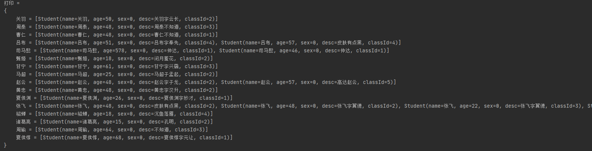
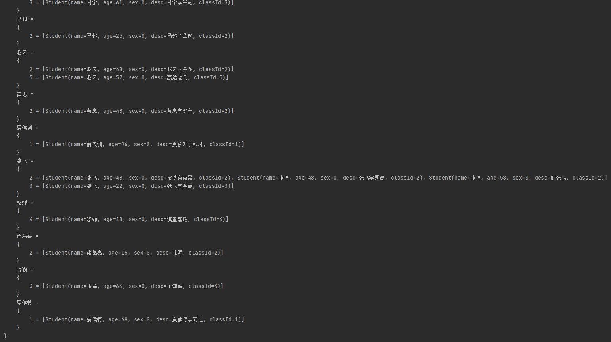

# Stream流处理list分组

可以进行去重，分组，如果不在数据库层面GroupBy，而在内存中做分组处理，使用Stream流处理很方便！

## 数据
```java
@Data
@Accessors(chain = true)
@NoArgsConstructor
@AllArgsConstructor
class Student {
    /**
     * 姓名
     */
    private String name;

    /**
     * 年龄
     */
    private Integer age;
    /**
     * 性别，0和1
     */
    private Integer sex;
    /**
     * 描述
     */
    private String desc;
    /**
     * 班级id，1.2.3...
     */
    private Integer classId;

    @Override
    public boolean equals(Object o) {
        if (this == o) return true;
        if (!(o instanceof Student)) return false;
        Student student = (Student) o;
        return getName().equals(student.getName());
    }

    @Override
    public int hashCode() {
        return Objects.hash(getName());
    }
}

class TestList{
    public static void main(String[] args) {
        List<Student> studentList = new ArrayList<>();
        studentList.add(new Student("张飞",48,0,"皮肤有点黑",2));
        studentList.add(new Student("关羽",50,0,"关羽字云长",2));
        studentList.add(new Student("吕布",51,0,"吕布字奉先",4));
        studentList.add(new Student("张飞",48,0,"张飞字翼德",2));
        studentList.add(new Student("张飞",22,0,"张飞字翼德",3));
        studentList.add(new Student("赵云",48,0,"赵云字子龙",2));
        studentList.add(new Student("马超",25,0,"马超子孟起",2));
        studentList.add(new Student("黄忠",48,0,"黄忠字汉升",2));
        studentList.add(new Student("夏侯渊",26,0,"夏侯渊字妙才",1));
        studentList.add(new Student("夏侯惇",68,0,"夏侯惇字元让",1));
        studentList.add(new Student("曹仁",48,0,"曹仁不知道",1));
        studentList.add(new Student("甘宁",61,0,"甘宁字兴霸",3));
        studentList.add(new Student("周泰",48,0,"周泰不知道",3));
        studentList.add(new Student("诸葛亮",15,0,"孔明",2));
        studentList.add(new Student("周瑜",64,0,"不知道",3));
        studentList.add(new Student("司马懿",578,0,"仲达",1));
        studentList.add(new Student("司马懿",46,0,"仲达",1));
        studentList.add(new Student("张飞",58,0,"假张飞",2));
        studentList.add(new Student("赵云",57,0,"高达赵云",5));
        studentList.add(new Student("吕布",57,0,"皮肤有点黑",4));
        studentList.add(new Student("貂蝉",18,0,"沉鱼落雁",4));
        studentList.add(new Student("甄姬",18,0,"闭月羞花",2));
        //手工创建一些数据测试
        //情形一，名字相同的全部当做重复
        Set<Student> nameSet = new HashSet<>();
        for (Student s:studentList) {
            nameSet.add(s);
        }
        for (Student s:nameSet) {
            System.out.println(s);
        }

    }

}

```

## 分组

根据名称分组:
```java
Map<String,List<Student>> map = studentList.stream().collect(Collectors.groupingBy(Student::getName));
MapUtils.verbosePrint(System.out,"打印",map);
```
结果：



通过distinct()去重：
重写hashCode和equals方法，然后再使用distinct()去重
```java
studentList.stream().distinct().collect(Collectors.toList()).stream().forEach(System.out::println);
```
结果：
```java
Student(name=张飞, age=48, sex=0, desc=皮肤有点黑, classId=2)
Student(name=关羽, age=50, sex=0, desc=关羽字云长, classId=2)
Student(name=吕布, age=51, sex=0, desc=吕布字奉先, classId=4)
Student(name=赵云, age=48, sex=0, desc=赵云字子龙, classId=2)
Student(name=马超, age=25, sex=0, desc=马超子孟起, classId=2)
Student(name=黄忠, age=48, sex=0, desc=黄忠字汉升, classId=2)
Student(name=夏侯渊, age=26, sex=0, desc=夏侯渊字妙才, classId=1)
Student(name=夏侯惇, age=68, sex=0, desc=夏侯惇字元让, classId=1)
Student(name=曹仁, age=48, sex=0, desc=曹仁不知道, classId=1)
Student(name=甘宁, age=61, sex=0, desc=甘宁字兴霸, classId=3)
Student(name=周泰, age=48, sex=0, desc=周泰不知道, classId=3)
Student(name=诸葛亮, age=15, sex=0, desc=孔明, classId=2)
Student(name=周瑜, age=64, sex=0, desc=不知道, classId=3)
Student(name=司马懿, age=578, sex=0, desc=仲达, classId=1)
Student(name=貂蝉, age=18, sex=0, desc=沉鱼落雁, classId=4)
Student(name=甄姬, age=18, sex=0, desc=闭月羞花, classId=2)
```

## 多重分组

根据名字和class分组，也就是说名字和班级都相同的才算重复

```java
 Map<String,Map<Integer,List<Student>>> map1 = studentList.stream().collect(
                Collectors.groupingBy(Student::getName, Collectors.groupingBy(Student::getClassId))
        );
        MapUtils.verbosePrint(System.out,"打印",map1);
```


结果：



