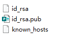
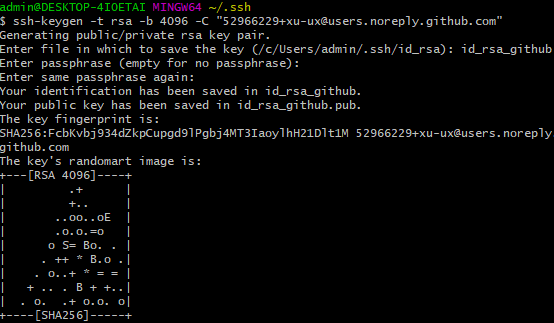
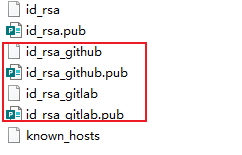
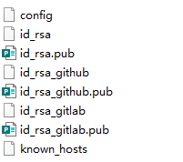
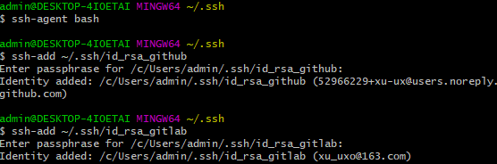

# Windows下Git多账号配置,同一电脑多个ssh-key的管理

因为工作需要连接多中仓库，github.com、git.oschina.net、gitlab、gitee

**用管理员身份运行CMD或者Git Bash客户端**


## 1. 查看.ssh

Windowsy一般在目录`C:\Users\admin\.ssh`




## 2.为每个账号生成SSH密钥

git bash 执行如下命令：

`$ ssh-keygen -t rsa -b 4096 -C "your_email@example.com"`

`your_email@example.com `替换你成 Git账号的电子邮件地址。
网上可能很多都是用的 ` ssh-keygen -t rsa -C "your_email@example.com" `。
这2者的区别是上面那条命令（有-b 4096的）可以让本地机器ssh登录远程机器上的GitHub账户无需输入密码

> SSH默认的生成文件是 id_rsa.pub 和 id_rsa，如果你已经生成过SSH了，那么你在新建另一个账号的SSH的时候，它会提示你 "Your public key has been saved in /c/Users/admin/.ssh/id_rsa.pub",这个时候你需要另取一个名字，如生成github账号的你可以设置为 /c/Users/admin/.ssh/id_rsa_github

### 2.1 生成github.com对应的私钥公钥

命名为id_rsa_github，密码654321

```shell
ssh-keygen -t rsa -b 4096 -C "52966229+xu-ux@users.noreply.github.com"
Generating public/private rsa key pair.
Enter file in which to save the key (/c/Users/admin/.ssh/id_rsa): id_rsa_github
Enter passphrase (empty for no passphrase):#输入密码
Enter same passphrase again:#输入密码
Your identification has been saved in id_rsa_github.
Your public key has been saved in id_rsa_github.pub.
The key fingerprint is:
SHA256:FcbKvbj934dZkpCupgd9lPgbj4MT3IaoylhH21Dlt1M 52966229+xu-ux@users.noreply.github.com
The key's randomart image is:
+---[RSA 4096]----+
|         .+      |
|         +..     |
|       ..oo..oE  |
|       .o.o.=o   |
|      o S= Bo. . |
|     . ++ * B.o .|
|    . o..+ * = = |
|   + .. . B + +..|
|  . o.  .+ o.o. o|
+----[SHA256]-----+

```



### 2.2 生成gitlab.com对应的私钥公钥

命名为id_rsa_gitlab，密码654321

```shell
$ ssh-keygen -t rsa -b 4096 -C "xu_uxo@163.com"
Generating public/private rsa key pair.
Enter file in which to save the key (/c/Users/admin/.ssh/id_rsa): id_rsa_gitlab
Enter passphrase (empty for no passphrase):#输入密码
Enter same passphrase again:#输入密码
Your identification has been saved in id_rsa_gitlab.
Your public key has been saved in id_rsa_gitlab.pub.
The key fingerprint is:
SHA256:8R1HlOvj5yC5/I3/uqC3iAubBMkhgM2C6a9tQYg9oRw xu_uxo@163.com
The key's randomart image is:
+---[RSA 4096]----+
|++           .o. |
|=E+          ..  |
|+++..   .   . .. |
|o+o+ o   o . o.  |
|  o.+   S . ..   |
|   o .       .o  |
|  o . o     +... |
| . o . + . +.+.+.|
|  .   o o.o.+o=**|
+----[SHA256]-----+
```


### 2.3 把github对应的公钥和gitlab对应的公钥上传到服务器

刚刚生成的密钥



## 3.修改.ssh目录下的config文件，没有就创建一个

每个账号单独配置一个**Host**，每个**Host**要取一个别名，每个Host主要配置**HostName**和**IdentityFile**两个属性即可

**Host**的名字可以取为自己喜欢的名字，不过这个会影响git相关命令，例如：
**Host** mygithub 这样定义的话，命令如下，即git@后面紧跟的名字改为**mygithub**
git clone git@**mygithub**:PopFisher/AndroidRotateAnim.git

 ```
HostName 　　　　　　　   这个是真实的域名地址
IdentityFile 　　　　　　　  这里是id_rsa的地址
PreferredAuthentications   配置登录时用什么权限认证--可设为publickey,password publickey,keyboard-interactive等
User 　　　　　　　　　　　配置使用用户名
 ```



### config文件配置如下：

```shell
# 配置github.com
Host github.com                 
    HostName github.com
    IdentityFile C:\\Users\\admin\\.ssh\\id_rsa_github
    PreferredAuthentications publickey
    User username1

# 配置git.oschina.net 
Host git.oschina.net 
    HostName git.oschina.net
    IdentityFile C:\\Users\\admin\\.ssh\\id_rsa_oschina
    PreferredAuthentications publickey
    User username2
    
```

```shell
# gitlab
       Host gitlab.shfengqu.com
       HostName gitlab.shfengqu.com
       IdentityFile ~/.ssh/id_rsa //默认私钥的名字
       User ***

# github
       Host github.com
       HostName github.com
       IdentityFile ~/.ssh/id_rsa_github //创建github账号时取的私钥的名字
       User ***

# wxapp
       Host git.weixin.qq.com
       HostName git.weixin.qq.com
       IdentityFile ~/.ssh/id_rsa_wxapp //创建微信的git账号时取的私钥的名字
       User ***
```


## 4.将私钥添加到SSH agent

```shell
ssh-agent bash
ssh-add ~/.ssh/id_rsa_github
ssh-add ~/.ssh/id_rsa_gitlab
```




## 5.检查配置是否成功

```shell
ssh -T git@gitlab.test.com
Welcome to GitLab, test!

ssh -T git@192.168.1.110
Welcome to GitLab, test!

ssh -T git@github.com
The authenticity of host 'github.com (140.82.113.4)' can't be established.
RSA key fingerprint is SHA256:nThbg6kXUpJWGl7E1IGOCspRomTxdCARLviKw6E5SY8.
Are you sure you want to continue connecting (yes/no/[fingerprint])? yes
Warning: Permanently added 'github.com,140.82.113.4' (RSA) to the list of known hosts.
Hi xu-ux! You've successfully authenticated, but GitHub does not provide shell access.
```

## 6.git commit时注意不同仓库不同用户

我的全局用户是xucl，而github项目的用户是xu-ux

**项目配置**可以查看`.git/config`

**全局配置**可以查看`C:\Users\admin`

```shell
[user]
name = xu-ux
email = 52966229+xu-ux@users.noreply.github.com
```

如果不相符，在桌面打开git终端,输入以下命令：

修改当前项目的用户名和邮箱地址：
```shell
git config  user.name  "username"
git config  user.email  "email"
```
修改全局用户名和邮箱地址：

```shell
git config --global user.name "username"
git config --global user.email "email"
```

查看git用户名和邮箱地址命令：

```shell
git config user.name
git config user.email
```
