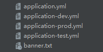

# 关于IDEA不显示application.yml文件小叶子的解决办法

事情的起因是，先去下载了一个关于yaml文件的插件，后来就关闭了

等到我下次愉快的打开IDEA时，发现文件变成`txt`样式支持了。

当然，所有的联想支持全部没有了，这还配置个毛线。

## 解决方案

在IDEA中，进入到
`File -> Settings -> Editor -> File Types`

`Recognized file types`（能够识别的文件类型），在这里面找到`YAML`这个类型，点开后就能看到`Registerd patterns`（已注册好的文件形式），里面只有一个`*.yaml`。

也就是说，只有`.yaml`后缀的文件才会被识别为`YAML`文件；那再看看`Text`，果不其然我们的`*.yml`却被注册到了`Text`中

**那现在按照图示修改：**

按照如图所示方法，可爱的小树叶就回来了

