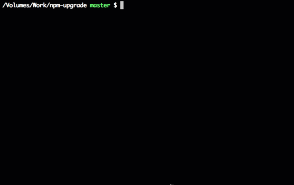

# 详解npm的常用指令

>https://www.npmjs.com/ 官网
> https://www.npmjs.com.cn/ 中文文档

## 了解npm

npm是随同NodeJS一起安装的包管理工具，能解决NodeJS代码部署上的很多问题，常见的使用场景有以下几种：

- 允许用户从npm服务器下载别人编写的第三方包到本地使用。
- 允许用户从npm服务器下载并安装别人编写的命令行程序到本地使用。
- 允许用户将自己编写的包或命令行程序上传到NPM服务器供别人使用。

## npm的常用命令

说到npm的指令，大家可以查看一下官网，太多了我就不一一说明了，在这里就简单得给大家介绍一下我们日常开发工作中常用的。

1. `npm install 包名`  下载项目包 (简写 npm i 包名)
2. `npm install 包名@版本号`  下载指定版本的项目包
3. `npm init` 在项目包中引导创建一个package.json 文件
4. `npm uninstall 包名`  删除（卸载）项目包
5. `npm install`  默认读取当前文件夹下的 package.json

## `install`安装和卸载详解

> https://docs.npmjs.com/cli/v7/commands/npm-install


```shell
npm install (with no args, in package dir)
npm install [<@scope>/]<name>
npm install [<@scope>/]<name>@<tag>
npm install [<@scope>/]<name>@<version>
npm install [<@scope>/]<name>@<version range>
npm install <alias>@npm:<name>
npm install <git-host>:<git-user>/<repo-name>
npm install <git repo url>
npm install <tarball file>
npm install <tarball url>
npm install <folder>

aliases: npm i, npm add
common options: [-P|--save-prod|-D|--save-dev|-O|--save-optional|--save-peer] [-E|--save-exact] [-B|--save-bundle] [--no-save] [--dry-run]
```


### ① 全局安装/卸载

```shell
npm install -g
npm uninstall -g 
```


### ② 生产环境安装/卸载

这里的依赖包放在`dependency`中

```shell
npm install module_name -S # 简写
npm install module_name --save # 写入dependencies

npm uninstall module_name -S # 简写
npm uninstall module_name --save # 写入dependencies
```

`module_name`报名

### ③ 开发环境安装/卸载

这里的依赖包放在`devDependency`中

```shell
npm install module_name -D  # 简写
npm install module_name --save-dev # 写入devDependencies

npm uninstall module_name -D  # 简写
npm uninstall module_name --save-de # 写入devDependencies
```


### ④ 修改默认安装目录和缓存

```shell
# 查看当前npm包的全局安装路径
npm prefix -g

# 修改npm的包的全局安装路径
npm config set prefix "D:\ProgramFiles\nodejs\node_global_modules"

# 修改npm的包的全局cache位置
npm config set cache "D:\ProgramFiles\nodejs\node_npm_cache"

```


### ⑤ 查看所有包和配置

```shell
# 查看所有全局安装的模块
npm ls -g

# 查看npm默认设置（部分）
npm config ls

# 查看npm默认设置（全部）
npm config ls -l
```


## 更新命令详解

### ① 检查更新

```shell
# 先安装
npm install -g npm-check

npm-check
```


### ② 交互式更新

https://www.npmjs.com/package/npm-upgrade

```shell
# 先安装
npm install -g npm-upgrade #或者npm i -g npm-upgrade

npm-upgrade
# 有三种指令
npm-upgrade <option>
options: 
check [filter]          # Check for outdated modules
ignore <command>        # Manage ignored modules
changelog <moduleName>  # Show changelog for a module

```



- `Yes`将更新版本在，但不是立即，只有在您处理所有过时的模块并确认更新或选择更新后，才会更新。
- `No`不会更新此模块版本。
- `Show changelog`将尝试为当前模块查找更改日志网址，并在默认浏览器中打开它。
- `Ignore`将此模块添加到忽略的列表中
- `Finish update process`在完成更新过程后，并将所有更改保存在`package.json`中


###　③ `npm update`更新

```shell
# 更新全局包：
npm update -g

# 更新生产环境依赖包：
npm update --save

# 更新开发环境依赖包：
npm update --save-dev
```


## npm多版本安装问题

npm 无法同时安装同一个 package 的不同版本，但是在 npm 6.9 以后，npm 可以为安装的包使用别名，可以近乎完美地解决这个问题了。

使用别名：

```shell
npm install <alias>@npm:<name>
```

比方说要同时安装 `7.x` 和 `6.x`, 运行以下命令

```shell
npm install es6@npm:@elastic/elasticsearch@6
npm install es7@npm:@elastic/elasticsearch@7
```

`package.json` 文件就会多出下面的两行：

```shell
"dependencies": {
  "es6": "npm:@elastic/elasticsearch@6.7.0",
  "es7": "npm:@elastic/elasticsearch@7.0.0"
}
```

在代码中将刚刚定义的别名 `require` 进来。

```shell
const {Client: Client6} = require('es6')
const {Client: Client7} = require('es7')
 
const client6 = new Client6({node: 'http://localhost:9200'})
const client7 = new Client7({node: 'http://localhost:9201'})
 
client6.info(console.log)
client7.info(console.log)
```


## npm的其他命令

- ​                  [access](https://www.npmjs.cn/cli/access)                  Set access level on published packages                
- ​                  [adduser](https://www.npmjs.cn/cli/adduser)                  Add a registry user account                
- ​                  [audit](https://www.npmjs.cn/cli/audit)                  Run a security audit                
- ​                  [bin](https://www.npmjs.cn/cli/bin)                  显示 npm 的 bin 文件夹的路径                
- ​                  [bugs](https://www.npmjs.cn/cli/bugs)                  Bugs for a package in a web browser maybe                
- ​                  [build](https://www.npmjs.cn/cli/build)                  构建一个包                
- ​                  [bundle](https://www.npmjs.cn/cli/bundle)                  此命令已被删除                
- ​                  [cache](https://www.npmjs.cn/cli/cache)                  Manipulates packages cache                
- ​                  [ci](https://www.npmjs.cn/cli/ci)                  Install a project with a clean slate                
- ​                  [completion](https://www.npmjs.cn/cli/completion)                  Tab Completion for npm                
- ​                  [config](https://www.npmjs.cn/cli/config)                  Manage the npm configuration files                
- ​                  [dedupe](https://www.npmjs.cn/cli/dedupe)                  Reduce duplication                
- ​                  [deprecate](https://www.npmjs.cn/cli/deprecate)                  作废指定包的指定版本                
- ​                  [dist-tag](https://www.npmjs.cn/cli/dist-tag)                  Modify package distribution tags                
- ​                  [docs](https://www.npmjs.cn/cli/docs)                  Docs for a package in a web browser maybe                
- ​                  [doctor](https://www.npmjs.cn/cli/doctor)                  Check your environments                
- ​                  [edit](https://www.npmjs.cn/cli/edit)                  Edit an installed package                
- ​                  [explore](https://www.npmjs.cn/cli/explore)                  Browse an installed package                
- ​                  [help](https://www.npmjs.cn/cli/help)                  Get help on npm                
- ​                  [help-search](https://www.npmjs.cn/cli/help-search)                  Search npm help documentation                
- ​                  [hook](https://www.npmjs.cn/cli/hook)                  Manage registry hooks                
- ​                  [init](https://www.npmjs.cn/cli/init)                  create a package.json file                
- ​                  [install](https://www.npmjs.cn/cli/install)                  Install a package                
- ​                  [install-ci-test](https://www.npmjs.cn/cli/install-ci-test)                                  
- ​                  [install-test](https://www.npmjs.cn/cli/install-test)                                  
- ​                  [link](https://www.npmjs.cn/cli/link)                  Symlink a package folder                
- ​                  [logout](https://www.npmjs.cn/cli/logout)                  Log out of the registry                
- ​                  [ls](https://www.npmjs.cn/cli/ls)                  List installed packages                
- ​                  [npm](https://www.npmjs.cn/cli/npm)                  javascript package manager                
- ​                  [org](https://www.npmjs.cn/cli/org)                  Manage orgs                
- ​                  [outdated](https://www.npmjs.cn/cli/outdated)                  Check for outdated packages                
- ​                  [owner](https://www.npmjs.cn/cli/owner)                  Manage package owners                
- ​                  [pack](https://www.npmjs.cn/cli/pack)                  Create a tarball from a package                
- ​                  [ping](https://www.npmjs.cn/cli/ping)                  Ping npm 注册表                
- ​                  [prefix](https://www.npmjs.cn/cli/prefix)                  显示（目录）前缀                
- ​                  [profile](https://www.npmjs.cn/cli/profile)                  Change settings on your registry profile                
- ​                  [prune](https://www.npmjs.cn/cli/prune)                  移除无关的包                
- ​                  [publish](https://www.npmjs.cn/cli/publish)                  Publish a package                
- ​                  [rebuild](https://www.npmjs.cn/cli/rebuild)                  重新构建包                
- ​                  [repo](https://www.npmjs.cn/cli/repo)                  在浏览器中打开指定包的源码仓库页面                
- ​                  [restart](https://www.npmjs.cn/cli/restart)                  Restart a package                
- ​                  [root](https://www.npmjs.cn/cli/root)                  显示 npm 根目录                
- ​                  [run-script](https://www.npmjs.cn/cli/run-script)                  Run arbitrary package scripts                
- ​                  [search](https://www.npmjs.cn/cli/search)                  Search for packages                
- ​                  [shrinkwrap](https://www.npmjs.cn/cli/shrinkwrap)                  锁定依赖包的版本                
- ​                  [star](https://www.npmjs.cn/cli/star)                  标记你所喜欢的包                
- ​                  [stars](https://www.npmjs.cn/cli/stars)                  查看 star 过的包                
- ​                  [start](https://www.npmjs.cn/cli/start)                  start 脚本                
- ​                  [stop](https://www.npmjs.cn/cli/stop)                  stop 脚本                
- ​                  [team](https://www.npmjs.cn/cli/team)                  Manage organization teams and team memberships                
- ​                  [test](https://www.npmjs.cn/cli/test)                  test 脚本                
- ​                  [token](https://www.npmjs.cn/cli/token)                  Manage your authentication tokens                
- ​                  [uninstall](https://www.npmjs.cn/cli/uninstall)                  Remove a package                
- ​                  [unpublish](https://www.npmjs.cn/cli/unpublish)                  Remove a package from the registry                
- ​                  [update](https://www.npmjs.cn/cli/update)                  Update a package                
- ​                  [version](https://www.npmjs.cn/cli/version)                  Bump a package version                
- ​                  [view](https://www.npmjs.cn/cli/view)                  View registry info                
- ​                  [whoami](https://www.npmjs.cn/cli/whoami)                  显示 npm 用户名                