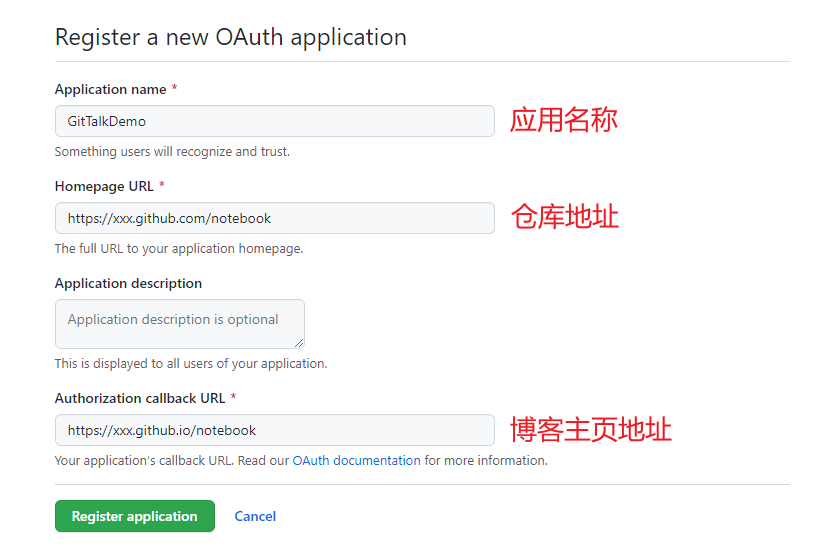

# Github上搭建自己的云笔记（二），集成GitTalk评论区插件

>docsify官方推荐两款插件，一个是Disqus，另一个是今天要集成的[GitTalk插件](https://docsify.js.org/#/zh-cn/plugins?id=gitalk)
>Gitalk，一个现代化的，基于Preact和Github Issue的评论系统。

## 1. 新增OAuth App

登录个人GitHub，在Setting/Developer settings/OAuth Apps/New OAuth App

https://github.com/settings/developers

#### 创建

由于这里是结合GitHub Pages使用，所以这里设置的都是github相关域名



其中

1）Application name 可以随便填一个。

2）Homepage URL 必须是博客仓库的域名（GitHub Pages 的），如果是自己的服务器搭建的博客，请使用自己的域名，配置中使用了仓库`notebook`作为评论区仓库（评论会提交到这个仓库里）。

3）Authorization callback URL 必须是可访问的博客域名（GitHub Pages的或者自己解析的域名都可以），配置中使用了github pages的 `notebook`作为回调地址。


#### 生成密钥


## 2. 配置

首先到docsify的index.html中添加如下配置信息

```html
<link rel="stylesheet" href="//cdn.jsdelivr.net/npm/gitalk/dist/gitalk.css">
<!-- md5引入 -->
<script src="https://cdn.bootcdn.net/ajax/libs/blueimp-md5/2.18.0/js/md5.min.js"></script>
<script src="//cdn.jsdelivr.net/npm/docsify/lib/plugins/gitalk.min.js"></script>
<script src="//cdn.jsdelivr.net/npm/gitalk/dist/gitalk.min.js"></script>
<script>
  const gitalk = new Gitalk({
    clientID: 'Github Application Client ID', // OAuth Apps的 clientID
    clientSecret: 'Github Application Client Secret', // OAuth Apps的 clientSecret
    repo: 'Github repo', // 仓库名称 如：notebook
    owner: 'Github repo owner',// Github的用户名 xxx
    admin: ['Github repo collaborators, only these guys can initialize github issues'], // 如：['xxx'] ['Github的用户名']
    id:  md5(location.pathname),// 页面的唯一标识。长度必须小于50
    title: location.pathname, // GitHub issue 的标题
    distractionFreeMode: false
  })
</script>
```

#### 设置信息

- **clientID** `String`

  **必须**. GitHub Application Client ID.

- **clientSecret** `String`

  **必须**. GitHub Application Client Secret.

- **repo** `String`

  **必须**. GitHub repository.

- **owner** `String`

  **必须**. GitHub repository 所有者，可以是个人或者组织。

- **admin** `Array`

  **必须**. GitHub repository 的所有者和合作者 (对这个 repository 有写权限的用户)。

- **id** `String`

  Default: `location.href`.

  页面的唯一标识。长度必须小于50。

- **number** `Number`

  Default: `-1`.

  页面的 issue ID 标识，若未定义`number`属性则会使用`id`进行定位。

- **labels** `Array`

  Default: `['Gitalk']`.

  GitHub issue 的标签。

- **title** `String`

  Default: `document.title`.

  GitHub issue 的标题。

- **body** `String`

  Default: `location.href + header.meta[description]`.

  GitHub issue 的内容。

- **language** `String`

  Default: `navigator.language || navigator.userLanguage`.

  设置语言，支持 [en, zh-CN, zh-TW]。

- **perPage** `Number`

  Default: `10`.

  每次加载的数据大小，最多 100。

- **distractionFreeMode** `Boolean`

  Default: false。

  类似Facebook评论框的全屏遮罩效果.

- **pagerDirection** `String`

  Default: 'last'

  评论排序方式， `last`为按评论创建时间倒叙，`first`为按创建时间正序。

- **createIssueManually** `Boolean`

  Default: `false`.

  如果当前页面没有相应的 isssue 且登录的用户属于 admin，则会自动创建 issue。如果设置为 `true`，则显示一个初始化页面，创建 issue 需要点击 `init` 按钮。

- **proxy** `String`

  Default: `https://cors-anywhere.herokuapp.com/https://github.com/login/oauth/access_token`.

  GitHub oauth 请求到反向代理，为了支持 CORS。

- **flipMoveOptions** `Object`

  Default:

  

  ```source-js
    {
      staggerDelayBy: 150,
      appearAnimation: 'accordionVertical',
      enterAnimation: 'accordionVertical',
      leaveAnimation: 'accordionVertical',
    }
  ```

  评论列表的动画。

- **enableHotKey** `Boolean`

  Default: `true`.

  启用快捷键(cmd|ctrl + enter) 提交评论.

#### 效果


## 3. 配置中出现的问题

**先检查GitTalk的配置项和OAuth App的配置项是否都是正确的**


### GitTalk报错出现 Error: Not Found.

#### 原因

1.  issues未启用，注意在 setting 中启用该仓库的 issues

   

2. OAuth App中的Authorization callback URL配置错误

3. GitTalk的配置项错误 `repo` `owner`


### GitTalk报错出现 Error: Validation Failed.

https://github.com/gitalk/gitalk/issues/102

#### 原因

1. label 的长度不能超过50，gittalk的id字段会作为lable

2. GitTalk中缺少某些配置项，比如id、title字段


#### 检查

`admin`配置项

`id`配置项

`title`配置项

打开控制台F12

查看返回 `422` 的这个请求的返回的结果：

```json
// 这个是长度问题，使用md5后不会出现这种问题
{
  "message": "Validation Failed",
  "errors": [
    {
      "value": "/2018/02/03/%E2%80%9C%E5%9F%83%E6%B0%8F%E7%AD%9B%E6%B3%95%E2%80%9D%E6%80%9D%E6%83%B3%E8%BF%90%E7%94%A8/",
      "resource": "Label",
      "field": "name",
      "code": "invalid"
    }
  ],
  "documentation_url": "https://developer.github.com/v3/issues/#create-an-issue"
}
```

