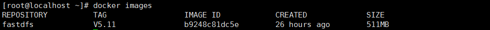

# docker安装fastdfs碰到storage的IP地址映射宿主地址问题

> 本文转载自https://my.oschina.net/binny/blog/3062250

## 一、概述

​		最近公司准备全面实施docker部署，解决每次项目实施安装部署环境工作量大问题，mysql5.7、oracle12c很顺利，在安装`fastdfs`时碰到**storage的IP地址映射问题**。

​		服务器采用的是CentOS7.6，关闭了firewall，启动镜像后在局域网其他机器无法通过`fastdfs-java-client`上传文件，获取的storage的IP地址为容器的IP地址，局域网其他机器无法访问容器的IP地址，查找了很多资料包括：`docker-proxy` 、`iptables` 等最终解决问题，记录下来方便。


##  二、fastdfs镜像安装和容器启动

 `fastdfs`镜像是通过作者提供的`dockerfile`进行构建：[Dockerfile](https://github.com/happyfish100/fastdfs/tree/master/docker/dockerfile_network)，构建比较简单，下载作者提供的`dockerfile_network`目录，里面包含了用最新的代码构建`fastdfs`的镜像，然后在目录执行：

```shell
docker build -t fastdfs:V5.11
```


构建成功后，通过`docker images`查看镜像




启动镜像，本机的IP地址为 192.168.1.98 执行以下命令启动：

```shell
docker run -d -e FASTDFS_IPADDR=192.168.1.98 -p 8888:8888 -p 22122:22122 -p 23000:23000 -p 8011:80 --name test-fast fastdfs:V5.11
```


## 三、问题描述和分析

​		在另一台机器192.168.1.230使用[fastdfs-client-java](https://github.com/happyfish100/fastdfs-client-java) 测试上传图片，总是报错提示`connect time out`，调试代码后发现连接到`tracker server` (192.168.1.98:22122)成功的，并且返回了`storage`信息，但是`storage`地址是：**172.17.0.1:23000**，**192.168.1.230**是无法连接到**172.17.0.1**的IP，这个IP是docker的一个虚拟网卡IP，用于桥接运行容器，如下图：


​		查看了作者提供的**fastdfs.sh**文件，容器启动时已经把storage.conf的配置文件里面的`tracker_server`地址替换为`FASTDFS_IPADDR=192.168.1.98`参数的地址，也就是说`storage`是连接到`tracker server`的地址是192.168.1.98:22122，按道理`storage`注册到`tracker server`的地址应该也是192.168.1.98，进入容器查看`tracker server`的信息：

```bash
[root@localhost ~]# docker exec -it test-fast /bin/bash
[root@854ce848546a /]# /usr/bin/fdfs_monitor /etc/fdfs/storage.conf
```


到这里问题已经找到了，`storage server`在容器里面连接到192.168.1.98:22122 地址时，`tracker server`记录到`storage`的地址是 **docker0虚拟网卡**（172.17.0.1）的地址。

对centos下docker的网络不熟悉，百度学习了很久的 docker网络（Bridge模式、Host模式、Containner模式等）、iptables的知识后，大概知道`storage server在`容器里面连接192.168.1.98:22122 ，通过NAT表转发到`tracker server`时，数据包里面的源地址为：172.17.0.1，导致了tracker server默认认为storage的地址是172.17.0.1


##  四、解决问题的思路

 在学习了iptables的知识后（主要看了 [http://www.zsythink.net/archives/1199/ ](http://www.zsythink.net/archives/1199/)  ）后，已经明白在NAT表转发过程中，数据达到172.17.0.2的22122端口记录的源地址是 172.17.0.1，我们只需要修改iptables的NAT表规则，所有转发到172.12.0.2:22122的数据，源地址修改为宿主主机的地址：192.168.1.98，这样storage注册到tracker server时，tracker server获取到storage的ip地址为 192.168.1.88 ，而不是网关地址172.17.0.1

```shell
iptables -t nat -A POSTROUTING -p tcp -m tcp --dport 22122 -d 172.17.0.2 -j SNAT --to 192.168.1.98
```

使用iptables -L -t nat 查看nat表规则

 


重新执行fastdfs-client-java的工程，返回的storage的地址为 192.168.1.98，上传成功：


## 五、总结

个人感觉采用docker部署后，网络环境会比单机更加复杂，如果直接采用Host模式的网络和单机一样，如果采用Bridge模式的换会复杂很多，想学docker的话必须很好掌握docker的网络的基础知识。同时在liunx下如果使用了iptables的话，也需要了解docker和iptables的技术细节。

我觉得这个思路也许能解决目前fastdfs的内网IP映射外网进行上传的问题，找个时间试试看。


## 六、附录

[官方Dockerfile](https://github.com/happyfish100/fastdfs/blob/master/docker/dockerfile_network/Dockerfile)

```shell
# centos 7
FROM centos:7
# 添加配置文件
ADD conf/client.conf /etc/fdfs/
ADD conf/http.conf /etc/fdfs/
ADD conf/mime.types /etc/fdfs/
ADD conf/storage.conf /etc/fdfs/
ADD conf/tracker.conf /etc/fdfs/
ADD fastdfs.sh /home
ADD conf/nginx.conf /etc/fdfs/
ADD conf/mod_fastdfs.conf /etc/fdfs

# run
RUN yum install git gcc gcc-c++ make automake autoconf libtool pcre pcre-devel zlib zlib-devel openssl-devel wget vim -y \
  &&    cd /usr/local/src  \
  &&    git clone https://github.com/happyfish100/libfastcommon.git --depth 1        \
  &&    git clone https://github.com/happyfish100/fastdfs.git --depth 1    \
  &&    git clone https://github.com/happyfish100/fastdfs-nginx-module.git --depth 1   \
  &&    wget http://nginx.org/download/nginx-1.15.4.tar.gz    \
  &&    tar -zxvf nginx-1.15.4.tar.gz    \
  &&    mkdir /home/dfs   \
  &&    cd /usr/local/src/  \
  &&    cd libfastcommon/   \
  &&    ./make.sh && ./make.sh install  \
  &&    cd ../  \
  &&    cd fastdfs/   \
  &&    ./make.sh && ./make.sh install  \
  &&    cd ../  \
  &&    cd nginx-1.15.4/  \
  &&    ./configure --add-module=/usr/local/src/fastdfs-nginx-module/src/   \
  &&    make && make install  \
  &&    chmod +x /home/fastdfs.sh

RUN ln -s /usr/local/src/fastdfs/init.d/fdfs_trackerd /etc/init.d/fdfs_trackerd \
  && ln -s /usr/local/src/fastdfs/init.d/fdfs_storaged /etc/init.d/fdfs_storaged 

# export config
VOLUME /etc/fdfs

EXPOSE 22122 23000 8888 80
ENTRYPOINT ["/home/fastdfs.sh"]
```

